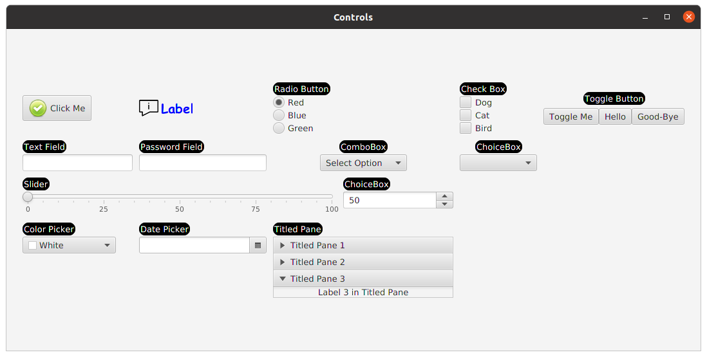

<h3>FXML for the above layout</h3>
<pre>
&lt;GridPane fx:controller="sample.Controller"
          xmlns:fx="http://javafx.com/fxml" alignment="center" hgap="10" vgap="10"&gt;

    &lt;Button GridPane.rowIndex="0" GridPane.columnIndex="0" text="Click Me"&gt;
        &lt;graphic&gt;
            &lt;ImageView fitHeight="30" fitWidth="30"&gt;
                &lt;Image url="@check.png"/&gt;
            &lt;/ImageView&gt;
        &lt;/graphic&gt;
    &lt;/Button&gt;

    &lt;Label GridPane.rowIndex="0" GridPane.columnIndex="1" text="Label" textFill="blue"&gt;
        &lt;font&gt;
            &lt;Font name="Comic Sans MS bold" size="20"/&gt;
        &lt;/font&gt;
        &lt;graphic&gt;
            &lt;ImageView fitWidth="30" fitHeight="30"&gt;
                &lt;Image url="@infoImage.png"/&gt;
            &lt;/ImageView&gt;
        &lt;/graphic&gt;
    &lt;/Label&gt;

    &lt;fx:define&gt;
        &lt;ToggleGroup fx:id="colorToggleGroup"/&gt;
    &lt;/fx:define&gt;
    &lt;VBox GridPane.rowIndex="0" GridPane.columnIndex="2" spacing="2"&gt;
        &lt;Label text="Radio Button" textFill="white"
               style="-fx-label-padding:1;
                -fx-border-width:1;
                -fx-border-color:black;
                -fx-border-radius:10;
                -fx-background-color:black;
                -fx-background-radius:10"/&gt;
        &lt;RadioButton text="Red" toggleGroup="$colorToggleGroup"
                     selected="true"/&gt;
        &lt;RadioButton text="Blue" toggleGroup="$colorToggleGroup"/&gt;
        &lt;RadioButton text="Green" toggleGroup="$colorToggleGroup"/&gt;
    &lt;/VBox&gt;

    &lt;VBox GridPane.rowIndex="0" GridPane.columnIndex="5" spacing="2"&gt;
        &lt;Label text="Check Box" textFill="white"
               style="-fx-label-padding:1;
                -fx-border-width:1;
                -fx-border-color:black;
                -fx-border-radius:10;
                -fx-background-color:black;
                -fx-background-radius:10"/&gt;
        &lt;CheckBox text="Dog"/&gt;
        &lt;CheckBox text="Cat"/&gt;
        &lt;CheckBox text="Bird"/&gt;
    &lt;/VBox&gt;

    &lt;VBox GridPane.rowIndex="0" GridPane.columnIndex="6" spacing="5" alignment="CENTER"&gt;
        &lt;Label text="Toggle Button" textFill="white"
               style="-fx-label-padding:1;
                -fx-border-width:1;
                -fx-border-color:black;
                -fx-border-radius:10;
                -fx-background-color:black;
                -fx-background-radius:10"/&gt;
        &lt;HBox&gt;
            &lt;ToggleButton text="Toggle Me"/&gt;
            &lt;ToggleButton text="Hello"/&gt;
            &lt;ToggleButton text="Good-Bye"/&gt;
        &lt;/HBox&gt;

    &lt;/VBox&gt;

    &lt;VBox GridPane.rowIndex="1" GridPane.columnIndex="0" spacing="2"&gt;
        &lt;Label text="Text Field" textFill="white"
               style="-fx-label-padding:1;
                -fx-border-width:1;
                -fx-border-color:black;
                -fx-border-radius:10;
                -fx-background-color:black;
                -fx-background-radius:10"/&gt;
        &lt;TextField/&gt;
    &lt;/VBox&gt;

    &lt;VBox GridPane.rowIndex="1" GridPane.columnIndex="1" spacing="2"&gt;
        &lt;Label text="Password Field" textFill="white"
               style="-fx-label-padding:1;
                -fx-border-width:1;
                -fx-border-color:black;
                -fx-border-radius:10;
                -fx-background-color:black;
                -fx-background-radius:10"/&gt;
        &lt;PasswordField/&gt;
    &lt;/VBox&gt;

    &lt;VBox GridPane.rowIndex="1" GridPane.columnIndex="2" GridPane.columnSpan="3" alignment="CENTER" spacing="2"&gt;
        &lt;Label text="ComboBox" textFill="white"
               style="-fx-label-padding:1;
                -fx-border-width:1;
                -fx-border-color:black;
                -fx-border-radius:10;
                -fx-background-color:black;
                -fx-background-radius:10"/&gt;
        &lt;ComboBox&gt;
            &lt;items&gt;
                &lt;FXCollections fx:factory="observableArrayList"&gt;
                    &lt;String fx:value="Option 1"/&gt;
                    &lt;String fx:value="Option 2"/&gt;
                    &lt;String fx:value="Option 3"/&gt;
                    &lt;String fx:value="Option 4"/&gt;
                    &lt;String fx:value="Option 5"/&gt;
                &lt;/FXCollections&gt;
            &lt;/items&gt;
            &lt;value&gt;
                &lt;String fx:value="Select Option"/&gt;
            &lt;/value&gt;
        &lt;/ComboBox&gt;

    &lt;/VBox&gt;
    &lt;VBox GridPane.rowIndex="1" GridPane.columnIndex="5" alignment="CENTER" spacing="2"&gt;
        &lt;Label text="ChoiceBox" textFill="white"
               style="-fx-label-padding:1;
                -fx-border-width:1;
                -fx-border-color:black;
                -fx-border-radius:10;
                -fx-background-color:black;
                -fx-background-radius:10"/&gt;
        &lt;ChoiceBox prefWidth="120"&gt;
            &lt;items&gt;
                &lt;FXCollections fx:factory="observableArrayList"&gt;
                    &lt;String fx:value="Choice Box 1"/&gt;
                    &lt;String fx:value="Choice Box 2"/&gt;
                    &lt;String fx:value="Choice Box 3"/&gt;
                    &lt;String fx:value="Choice Box 4"/&gt;
                    &lt;String fx:value="Choice Box 5"/&gt;
                &lt;/FXCollections&gt;
            &lt;/items&gt;
        &lt;/ChoiceBox&gt;

    &lt;/VBox&gt;
    &lt;VBox GridPane.rowIndex="2" GridPane.columnIndex="0" GridPane.columnSpan="4" spacing="2"&gt;
        &lt;Label text="Slider" textFill="white"
               style="-fx-label-padding:1;
                -fx-border-width:1;
                -fx-border-color:black;
                -fx-border-radius:10;
                -fx-background-color:black;
                -fx-background-radius:10"/&gt;

        &lt;Slider min="0" max="100"
                showTickLabels="true" showTickMarks="true" snapToTicks="true" minorTickCount="4"/&gt;
    &lt;/VBox&gt;

    &lt;VBox GridPane.rowIndex="2" GridPane.columnIndex="4" spacing="2"&gt;
        &lt;Label text="ChoiceBox" textFill="white"
               style="-fx-label-padding:1;
                -fx-border-width:1;
                -fx-border-color:black;
                -fx-border-radius:10;
                -fx-background-color:black;
                -fx-background-radius:10"/&gt;
        &lt;Spinner min="0" max="100" initialValue="50" editable="true"/&gt;
    &lt;/VBox&gt;

    &lt;VBox GridPane.rowIndex="3" GridPane.columnIndex="0" spacing="2"&gt;
        &lt;Label text="Color Picker" textFill="white"
               style="-fx-label-padding:1;
                -fx-border-width:1;
                -fx-border-color:black;
                -fx-border-radius:10;
                -fx-background-color:black;
                -fx-background-radius:10"/&gt;
        &lt;ColorPicker/&gt;
    &lt;/VBox&gt;

    &lt;VBox GridPane.rowIndex="3" GridPane.columnIndex="1" spacing="2"&gt;
        &lt;Label text="Date Picker" textFill="white"
               style="-fx-label-padding:1;
                -fx-border-width:1;
                -fx-border-color:black;
                -fx-border-radius:10;
                -fx-background-color:black;
                -fx-background-radius:10"/&gt;
        &lt;DatePicker/&gt;
    &lt;/VBox&gt;

    &lt;VBox GridPane.rowIndex="3" GridPane.columnIndex="2" GridPane.columnSpan="3" spacing="2"&gt;
        &lt;Label text="Titled Pane" textFill="white"
               style="-fx-label-padding:1;
                -fx-border-width:1;
                -fx-border-color:black;
                -fx-border-radius:10;
                -fx-background-color:black;
                -fx-background-radius:10"/&gt;
        &lt;Accordion expandedPane="$tp2"&gt;
            &lt;panes&gt;
                &lt;TitledPane fx:id="tp1" text="Titled Pane 1"&gt;
                    &lt;Label text="Label 1 in Titled Pane"/&gt;
                &lt;/TitledPane&gt;
                &lt;TitledPane fx:id="tp2" text="Titled Pane 2"&gt;
                    &lt;Label text="Label 2 in Titled Pane"/&gt;
                &lt;/TitledPane&gt;
                &lt;TitledPane fx:id="tp3" text="Titled Pane 3"&gt;
                    &lt;Label text="Label 3 in Titled Pane"/&gt;
                &lt;/TitledPane&gt;
            &lt;/panes&gt;
        &lt;/Accordion&gt;
    &lt;/VBox&gt;

&lt;/GridPane&gt;
</pre>
