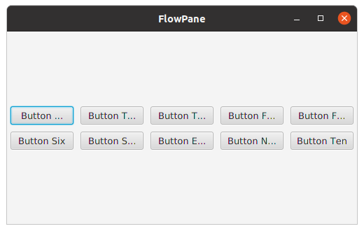

<h3>FXML for the above layout</h3>
<pre>
&lt;FlowPane fx:controller="sample.Controller" xmlns:fx="http://javafx/fxml" orientation="HORIZONTAL"
          hgap="10" vgap="10" alignment="CENTER"&gt;
    &lt;Button text="Button One" prefWidth="90"/&gt;
    &lt;Button text="Button Two" prefWidth="90"/&gt;
    &lt;Button text="Button Three" prefWidth="90"/&gt;
    &lt;Button text="Button Four" prefWidth="90"/&gt;
    &lt;Button text="Button Five" prefWidth="90"/&gt;
    &lt;Button text="Button Six" prefWidth="90"/&gt;
    &lt;Button text="Button Seven" prefWidth="90"/&gt;
    &lt;Button text="Button Eight" prefWidth="90"/&gt;
    &lt;Button text="Button Nine" prefWidth="90"/&gt;
    &lt;Button text="Button Ten" prefWidth="90"/&gt;
&lt;/FlowPane&gt;
</pre>
