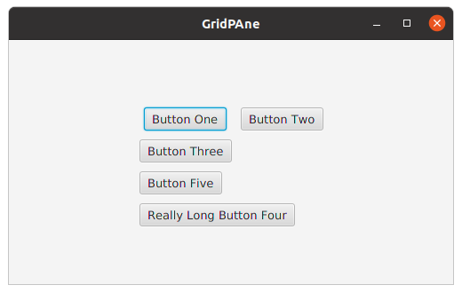

<h3>FXML for the above layout</h3>
<pre>
&lt;GridPane fx:controller="sample.Controller" xmlns:fx="http://javafx.com/fxml" alignment="center" hgap="10" vgap="10" gridLinesVisible="false"&gt;
    &lt;padding&gt;
        &lt;Insets top="10"/&gt;
    &lt;/padding&gt;
    &lt;Button text="Button One" GridPane.rowIndex="0" GridPane.columnIndex="0" GridPane.halignment="CENTER"/&gt;
    &lt;Button text="Button Two" GridPane.rowIndex="0" GridPane.columnIndex="1"/&gt;
    &lt;Button text="Button Three" GridPane.rowIndex="1" GridPane.columnIndex="0"/&gt;
    &lt;Button text="Button Five" GridPane.rowIndex="2" GridPane.columnIndex="0"/&gt;
    &lt;Button text="Really Long Button Four" GridPane.rowIndex="3" GridPane.columnIndex="0" GridPane.columnSpan="2"/&gt;
&lt;/GridPane&gt;
</pre>
