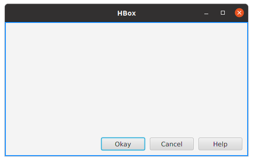

<h3>FXML for the above layout</h3>
<pre>
&lt;HBox fx:controller="sample.Controller"
      xmlns:fx="http://javafx.com/fxml" alignment="BOTTOM_RIGHT"
      style="-fx-border-color:dodgerblue;-fx-border-width: 2;"
      spacing="10"&gt;
    &lt;!--  Set padding  --&gt;
    &lt;padding&gt;
        &lt;Insets right="10" bottom="10"/&gt;
    &lt;/padding&gt;
    &lt;Button text="Okay" prefWidth="90"/&gt;
    &lt;Button text="Cancel" prefWidth="90"/&gt;
    &lt;Button text="Help" prefWidth="90"/&gt;
&lt;/HBox&gt;
</pre>
