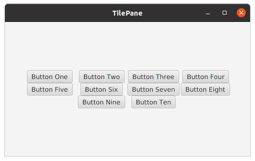

<h3>FMXL</h3>
<pre>
<code>
&lt;TilePane fx:controller="sample.Controller" xmlns:fx="http://javafx/fxml" alignment="CENTER"&gt;
    &lt;Button text="Button One" /&gt;
    &lt;Button text="Button Two" /&gt;
    &lt;Button text="Button Three" /&gt;
    &lt;Button text="Button Four" /&gt;
    &lt;Button text="Button Five" /&gt;
    &lt;Button text="Button Six" /&gt;
    &lt;Button text="Button Seven" /&gt;
    &lt;Button text="Button Eight" /&gt;
    &lt;Button text="Button Nine" /&gt;
    &lt;Button text="Button Ten" /&gt;
&lt;/TilePane&gt;
</code>
</pre>
